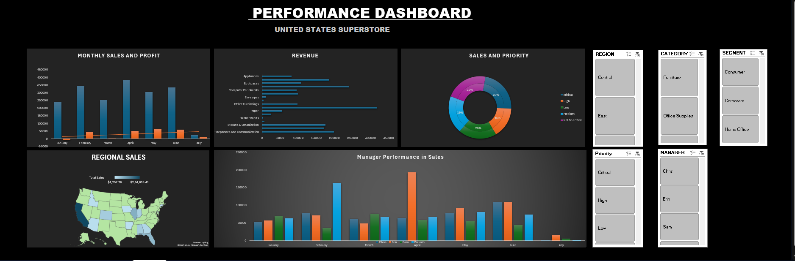

# Excel Sales Performance Dashboard

Interactive Excel dashboard built using Pivot Tables, Charts, and Slicers to analyze sales performance across regions, categories, and managers.

## Dashboard Preview

## Features

• Monthly Sales and Profit Analysis  
• Revenue by Product Category  
• Sales Priority Distribution  
• Regional Sales Map  
• Manager Performance Comparison  
• Interactive Filters (Region, Category, Segment, Priority, Manager)

## Tools Used

• Microsoft Excel  
• Pivot Tables  
• Pivot Charts  
• Slicers  
• Data Visualization

## Project Purpose

This project demonstrates how Excel can be used to build interactive dashboards for business performance analysis.
